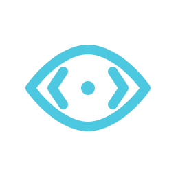
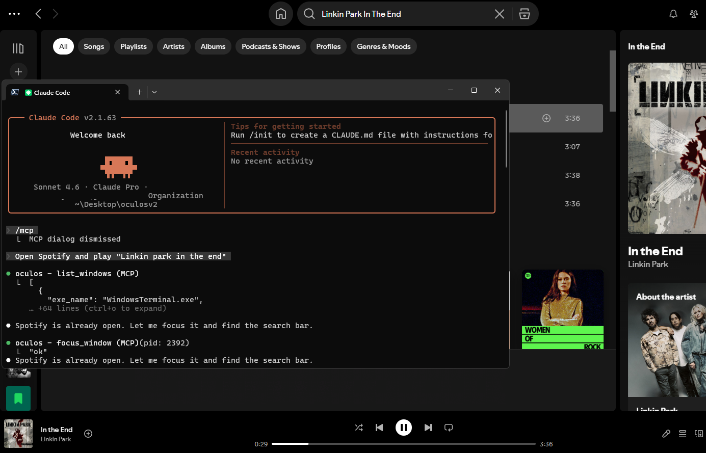
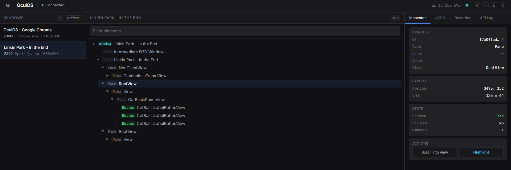

<p align="center">
  
</p>

<h1 align="center">OculOS</h1>

<p align="center">
  <strong>If it's on the screen, it's an API.</strong><br/>
  <sub>Control any desktop app through JSON. REST API + MCP server. Single binary. Zero dependencies.</sub>
</p>

<p align="center">
  <a href="#quick-start">Quick Start</a> •
  <a href="#how-it-works">How It Works</a> •
  <a href="#api">API</a> •
  <a href="#client-sdks">SDKs</a> •
  <a href="#mcp-setup">MCP Setup</a> •
  <a href="#dashboard">Dashboard</a> •
  <a href="./examples">Examples</a> •
  <a href="./openapi.yaml">API Spec</a> •
  <a href="./CHANGELOG.md">Changelog</a> •
  <a href="./CONTRIBUTING.md">Contributing</a>
</p>

<p align="center">
  <a href="LICENSE"></a>
  <a href="https://github.com/huseyinstif/oculos/stargazers"></a>
  
  
</p>

---

OculOS is a lightweight daemon that reads the OS accessibility tree and exposes every button, text field, checkbox, and menu item as a JSON endpoint. It works as a **REST API** for scripts, testing, and CI/CD — and as an **MCP server** for AI agents like Claude, Cursor, and Windsurf.

No screenshots. No pixel coordinates. No browser extensions. No code injection. No AI required. Just structured JSON.

---

### Claude Code + OculOS → Spotify

<p align="center">
  
</p>

<sub>Claude Code uses OculOS MCP tools to find Spotify, focus it, search for a song, and play it — fully autonomous.</sub>

### Web Dashboard

<p align="center">
  
</p>

<sub>Built-in dashboard with window list, interactive element tree, inspector, recorder, and live WebSocket events.</sub>

---

## Quick Start

```bash
git clone https://github.com/huseyinstif/oculos.git
cd oculos
cargo build --release
```

### macOS: Grant Accessibility Permission

OculOS reads the OS accessibility tree, so macOS requires you to grant permission:

1. Open **System Settings → Privacy & Security → Accessibility**
2. Click the **lock icon** and enter your password
3. Click **+** and add your terminal app (Terminal, iTerm2, Windsurf, etc.) or the `oculos` binary itself
4. Make sure the toggle is **enabled**

> Without this permission, OculOS can list windows but cannot read UI elements or interact with them.

### HTTP mode (API + Dashboard)

```bash
./target/release/oculos
# API       → http://127.0.0.1:7878
# Dashboard → http://127.0.0.1:7878
```

### MCP mode (for AI agents)

```bash
./target/release/oculos --mcp
```

---

## How It Works

OculOS reads the OS accessibility tree and assigns each UI element a session-scoped UUID (`oculos_id`). You use that ID to interact.

```bash
# 1. List open windows
curl http://localhost:7878/windows

# 2. Get the UI tree for a window
curl http://localhost:7878/windows/{pid}/tree

# 3. Find a specific element
curl "http://localhost:7878/windows/{pid}/find?q=Submit&type=Button"

# 4. Click it
curl -X POST http://localhost:7878/interact/{id}/click

# 5. Type into a text field
curl -X POST http://localhost:7878/interact/{id}/set-text \
  -H "Content-Type: application/json" \
  -d '{"text":"hello world"}'
```

Every element includes an `actions` array — the API tells you exactly what you can do:

```json
{
  "oculos_id": "a3f8c2d1-...",
  "type": "Button",
  "label": "Submit",
  "enabled": true,
  "actions": ["click", "focus"],
  "rect": { "x": 120, "y": 340, "width": 80, "height": 32 }
}
```

---

## API

### Discovery

| Endpoint | Description |
|----------|-------------|
| `GET /windows` | List all visible windows |
| `GET /windows/{pid}/tree` | Full UI element tree |
| `GET /windows/{pid}/find?q=&type=&interactive=` | Search elements |
| `GET /hwnd/{hwnd}/tree` | Tree by window handle |
| `GET /hwnd/{hwnd}/find` | Search by window handle |

### Window operations

| Endpoint | Description |
|----------|-------------|
| `POST /windows/{pid}/focus` | Bring to foreground |
| `POST /windows/{pid}/close` | Close gracefully |
| `GET /windows/{pid}/wait?q=&type=&timeout=` | Wait for element to appear (polls, default 5s) |
| `GET /windows/{pid}/screenshot` | Capture window as PNG |

### Element interactions

| Endpoint | Body | Description |
|----------|------|-------------|
| `POST /interact/{id}/click` | — | Click |
| `POST /interact/{id}/set-text` | `{"text":"…"}` | Replace text content |
| `POST /interact/{id}/send-keys` | `{"keys":"…"}` | Keyboard input |
| `POST /interact/{id}/focus` | — | Move focus |
| `POST /interact/{id}/toggle` | — | Toggle checkbox |
| `POST /interact/{id}/expand` | — | Expand dropdown / tree |
| `POST /interact/{id}/collapse` | — | Collapse |
| `POST /interact/{id}/select` | — | Select list item |
| `POST /interact/{id}/set-range` | `{"value":N}` | Set slider value |
| `POST /interact/{id}/scroll` | `{"direction":"…"}` | Scroll container |
| `POST /interact/{id}/scroll-into-view` | — | Scroll into viewport |
| `POST /interact/{id}/highlight` | `{"duration_ms":N}` | Highlight on screen |
| `POST /interact/batch` | `{"actions":[...]}` | Execute multiple interactions |

### System

| Endpoint | Description |
|----------|-------------|
| `GET /health` | Status, version, uptime |
| `GET /ws` | WebSocket (live action events) |

---

## MCP Setup

Works with any MCP-compatible client. Add to your config:

```json
{
  "mcpServers": {
    "oculos": {
      "command": "/path/to/oculos",
      "args": ["--mcp"]
    }
  }
}
```

**Tested with:** Claude Code, Claude Desktop, Cursor, Windsurf

For non-MCP agents (OpenAI, Gemini, custom), paste [`AGENTS.md`](./AGENTS.md) into the system prompt and give the agent HTTP access.

---

## Dashboard

Built-in web UI at `http://127.0.0.1:7878`:

- **Window list** — all open windows with focus/close buttons
- **Element tree** — full interactive UI tree with search and filter
- **Inspector** — element details, properties, and all available actions
- **Recorder** — record a sequence of interactions, export as **Python**, **JavaScript**, or **curl**
- **JSON viewer** — raw element data with copy
- **WebSocket** — live event indicator, real-time action feed
- **Shortcuts** — `R` refresh · `/` search · `E` expand · `C` collapse · `H` highlight · `J` JSON

---

## Platform Support

| Platform | Backend | Status |
|----------|---------|--------|
| **Windows** | UI Automation (`windows-rs`) | ✅ Full — Win32, WPF, Electron, Qt |
| **Linux** | AT-SPI2 (`atspi` + `zbus`) | ✅ Working — GTK, Qt, Electron |
| **macOS** | Accessibility API (`AXUIElement` + CoreGraphics) | ✅ Working — Cocoa, Electron, Qt |

### App Compatibility

| App type | Coverage | Notes |
|----------|----------|-------|
| **Win32 / WPF / WinForms** | Excellent | Full deep tree, all interactions |
| **GTK / Qt** | Excellent | Full tree on all platforms |
| **Electron** (Spotify, VS Code, Slack, Chrome) | Good | Key interactive elements exposed; tree is shallower than native |
| **Cocoa** (macOS native) | Good | Standard controls fully exposed |
| **Custom-drawn / OpenGL / DirectX** | Poor | Minimal or no accessibility tree — games, CAD, etc. |

> **Tip:** Run `curl "localhost:7878/windows/{pid}/find?interactive=true"` to see what's available for any app.

---

## Client SDKs

Official wrappers for the REST API. Install from source (PyPI/npm packages coming soon):

### Python

```bash
cd sdk/python
pip install .
```

```python
from oculos import OculOS

client = OculOS()
windows = client.list_windows()
client.click(element_id)
client.set_text(element_id, "hello world")
```

See [`sdk/python`](./sdk/python) for full docs.

### TypeScript

```bash
cd sdk/typescript
npm install
npm run build
```

```typescript
import { OculOS } from "./sdk/typescript/src/index";

const client = new OculOS();
const windows = await client.listWindows();
await client.click(elementId);
await client.setText(elementId, "hello world");
```

See [`sdk/typescript`](./sdk/typescript) for full docs.

---

## CLI

```
oculos [OPTIONS]

  -b, --bind <ADDR>       Bind address [default: 127.0.0.1:7878]
      --static-dir <DIR>  Static files directory [default: static]
      --log <LEVEL>       Log level: trace/debug/info/warn/error [default: info]
      --mcp               Run as MCP server over stdin/stdout
  -h, --help              Print help
```

---

## How OculOS Differs

| | OculOS | Vision agents | Screen coordinate tools | Browser-only tools |
|---|---|---|---|---|
| **Approach** | OS accessibility tree | Screenshots + LLM | Pixel positions | DOM / a11y tree |
| **Scope** | Any desktop app | Any (with latency) | Any (fragile) | Browser only |
| **Speed** | Instant | Seconds | Instant | Instant |
| **Deterministic** | ✅ | ❌ | ✅ | ✅ |
| **GPU required** | ❌ | ✅ | ❌ | ❌ |
| **Cloud required** | ❌ | Usually | ❌ | ❌ |
| **Semantic** | ✅ Labels + types | Varies | ❌ Coordinates | ✅ |

---

## Everything Built So Far

### Core
- [x] Windows UIA backend (full — Win32, WPF, Electron, Qt)
- [x] Linux AT-SPI2 backend
- [x] macOS Accessibility backend (`AXUIElement`, CoreGraphics window enumeration, CGEvent keyboard simulation)
- [x] REST API server (Axum)
- [x] MCP server (JSON-RPC 2.0 over stdio)
- [x] Session-scoped element registry with UUIDs
- [x] Full keyboard simulation engine

### Dashboard
- [x] Window list with focus/close
- [x] Interactive element tree with search/filter
- [x] Element inspector with all actions
- [x] API request log
- [x] JSON viewer with copy
- [x] Keyboard shortcuts

### Advanced
- [x] Element highlighting (native GDI overlay)
- [x] Automation recorder (record + export Python/JS/curl)
- [x] WebSocket live events
- [x] Health endpoint (uptime, version, platform)

### Planned
- [ ] macOS element highlighting (native overlay)
- [x] Python & TypeScript client SDKs
- [x] Batch operations (multiple interactions per request)
- [x] Conditional waits (`/wait` endpoint with timeout)
- [x] Screenshot capture (`/screenshot` endpoint)
- [x] GitHub Actions CI (Windows, Linux, macOS)
- [x] Docker image for CI/CD
- [x] OpenAPI spec
- [x] `--version` CLI flag
- [ ] Element caching & diffing (change detection)
- [ ] PyPI / npm SDK publishing

---

## Contributing

We welcome contributions! See [CONTRIBUTING.md](./CONTRIBUTING.md) for details.

**Top areas:**
- **Tests** — cross-app integration tests
- **macOS highlight** — native overlay for element highlighting
- **Element caching** — change detection & diffing
- **Documentation** — guides, examples, tutorials

---

## License

[MIT](./LICENSE)
